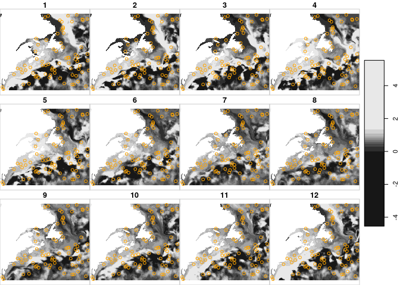

Brickman
================

Convenience tools for accessing Brickman Gulf of `Maine 2050` model
outputs.

> Cf: [Brickman D, Alexander MA, Pershing A, Scott JD, Wang Z.
> Projections of physical conditions in the Gulf of Maine in 2050. Elem
> Sci Anth. 2021 May
> 6;9(1):00055.](https://online.ucpress.edu/elementa/article/9/1/00055/116900/Projections-of-physical-conditions-in-the-Gulf-of)

Contents:

- PRESENT CLIMATE

- RCP45

  - year 2055
  - year 2075

- RCP85

  - year 2055
  - year 2075

Variables:

- Bathy_depth, land_mask
- Annual means: SST, MLD, SSS, Sbtm, Tbtm, U, V, Xbtm
- Monthly means: SST, MLD, SSS, Sbtm, Tbtm, U, V, Xbtm

### Requirements

- [R v4.1+](https://R-project.org)
- [rlang](https://CRAN.R-project.org/package=rlang)
- [dplyr](https://CRAN.R-project.org/package=dplyr)
- [ncdf4](https://CRAN.R-project.org/package=ncdf4)
- [stars](https://CRAN.R-project.org/package=stars)
- [sf](https://CRAN.R-project.org/package=sf)

### Installation

    remotes::install_github("BigelowLab/brickman")

### Usage

#### Reading and plotting

``` r
suppressPackageStartupMessages({
    library(stars)
    library(brickman)
    library(sf)
    library(dplyr)
    library(tidyr)
    library(ggplot2)
  })

x <- brickman::read_brickman(scenario ='RCP85', year = 2055, vars = 'SST', interval = "mon")
plot(x)
```

<!-- -->

#### Plotting a portion of curvilinear grid

You can display a portion of a curvilinear grid by specifying the
drawing extent. Note that by default R expands the plotting region. The
orange box shows the extent of the bounding box we used to define the
extent.

``` r
bb = c(xmin = -77, ymin = 36.5, xmax = -42.5, ymax = 56.7) |>
  st_bbox(crs = st_crs(x)) 
box = st_as_sfc(bb)  
plot(x, 
     extent = bb, 
     reset = FALSE,
     axes = FALSE)
```

    ## downsample set to 5

``` r
plot(box, color = NA, border = "orange", add = TRUE)
```

<!-- -->

### Subsetting/Cropping by transforming to regular grid

Subsetting and cropping curvilinear grid is not supported by
[stars](https://CRAN.R-project.org/package=stars) because (I think) gdal
doesn’t support it. We can transform (warp) to a regular grid and then
subset.

``` r
box4326 = st_transform(box, 4326)
warped = warp_brickman(x, crs = sf::st_crs(box4326))
sub = warped[bb]
plot(sub, reset = FALSE)
```

<!-- -->

### Extracting

Points can be extracted easily from the regular grid.

``` r
points = sf::st_sample(sf::st_as_sfc(bb), 100)

px = stars::st_extract(warped, points) |>
  sf::st_as_sf() |>
  rlang::set_names(c(month.abb, "geometry")) |>
  tidyr::pivot_longer(where(is.numeric),
                      names_to = "month",
                      values_to = "SST") |>
  dplyr::mutate(mon = match(month, month.abb)) |>
  dplyr::filter(!is.na(SST))


plot_hook = function(..., row = 0, col = 0, nr = 0, nrow = 0, ncol = 0, value = 0, bbox = NULL) {
  #cat("nr = ", nr, class(nr), "\n")
  z = dplyr::filter(px, mon == nr)
  plot(z['SST'], col = "orange", add = TRUE)
}

plot(sub, hook = plot_hook)
```

<!-- -->

``` r
px = px |>
  dplyr::mutate(month = factor(month, levels = month.abb)) 
ggplot() +
  geom_sf(data = px, aes(colour = SST)) +
  facet_wrap(~month)
```

<!-- -->
